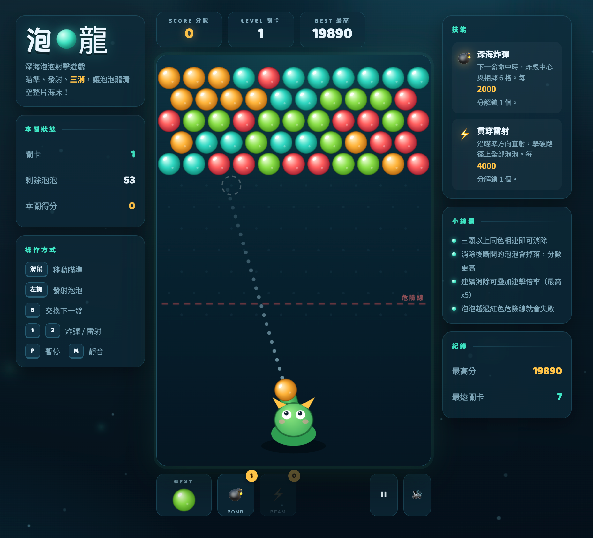

<p align="center">
  
</p>

<h1 align="center">🫧 泡泡龍 · Bubble Dragon</h1>

<p align="center">
  <a href="https://github.com/"></a>
  <a href="https://github.com/"></a>
  <a href="https://github.com/"></a>
  <a href="https://github.com/"></a>
</p>

<p align="center">
  深海泡泡射擊遊戲 —— 瞄準、發射、<b>三消</b>，讓泡泡龍清空整片海床！<br>
  單一 HTML 檔案、零依賴、開檔即玩。
</p>

---

## ✨ 遊戲特色

| | |
|:--:|:--|
| 🎯 **精準瞄準** | 虛線彈道預覽＋落點提示圈，支援牆面反彈 |
| 🔗 **三消機制** | 三顆以上同色相連即可消除 |
| 🪂 **掉落判定** | 消除後斷裂的泡泡會墜落，分數更高 |
| 🔥 **連擊系統** | 連續消除疊加倍率，最高 **x5** |
| 💣 **深海炸彈** | 炸毀中心與相鄰 6 格（每 2000 分解鎖） |
| ⚡ **貫穿雷射** | 沿瞄準方向擊破路徑上全部泡泡（每 4000 分解鎖） |
| 📈 **關卡 progression** | 顏色 4→6、泡泡層數 5→8 逐關加難 |
| 🏆 **紀錄保存** | 最高分與最遠關卡存入 `localStorage` |
| 🌊 **深海氛圍** | 浮游生物、光柱、粒子爆散、螢幕震動 |
| 🔊 **合成音效** | 純 WebAudio 即時生成，可靜音 |
| 📱 **響應式** | 桌面雙側欄＋手機單欄自動切換 |

---

## 🎮 操作說明

### 鍵盤

| 按鍵 | 功能 |
|:--:|:--|
| `1` | 使用 **炸彈** 💣 |
| `2` | 使用 **雷射** ⚡ |
| `S` | 交換「當前」與「下一發」泡泡 |
| `P` / `Esc` | 暫停 / 繼續 |
| `M` | 開關音效 |
| `R` | 重新開始（遊戲結束或暫停時） |

### 滑鼠 / 觸控

| 操作 | 功能 |
|:--:|:--|
| 移動 | 調整瞄準方向 |
| 點擊 / 點按 | 發射泡泡 |
| 點擊 NEXT 框 | 交換下一發 |

> 💡 極端角度會自動夾在 ±15° 內，避免無效向下發射。

---

## 🚀 如何執行

### 方式一：直接開啟（最簡單）

1. 下載或複製 `index.html`
2. 用瀏覽器（Chrome / Edge / Firefox / Safari）雙擊開啟
3. 點擊「**開始遊戲**」即可遊玩 ✅

### 方式二：本地伺服器（推薦）

```bash
# 進入專案資料夾
cd PuzzleBubble

# 用 Python
python3 -m http.server 8000
# 或用 Node
npx serve
