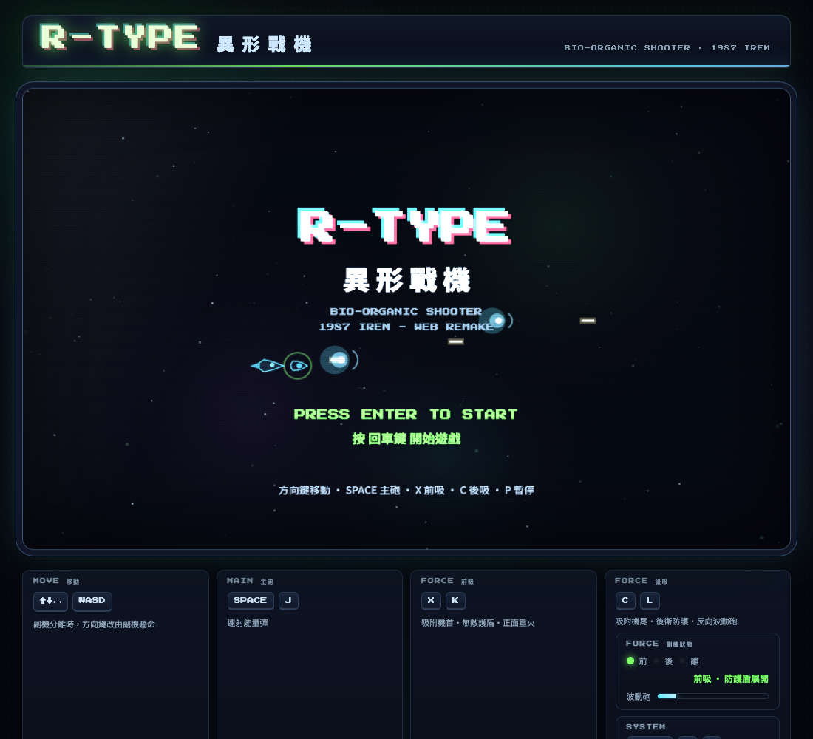

<p align="center">
  
</p>

<p align="center">
  
  
  
  
  
</p>

<h1 align="center">👾 R-TYPE <span style="color:#5fe8ff">異形戰機</span></h1>

<p align="center">
  <strong>向 1987 年 IREM 經典橫版射擊神作（STG）致敬的純前端網頁重製版。</strong><br>
  單一 HTML 檔案即完整遊戲 —— 零外部圖檔、零音訊依賴、零套件建置，即開即玩。
</p>

<p align="center">
  <a href="#-遊戲特色">遊戲特色</a> ·
  <a href="#-如何執行">如何執行</a> ·
  <a href="#-操作說明">操作說明</a> ·
  <a href="#-核心系統--戰術指南">核心系統 & 戰術指南</a> ·
  <a href="#-敵方與-boss-生態">敵方與 Boss 生態</a> ·
  <a href="#-技術亮點">技術亮點</a>
</p>

---

## ✨ 遊戲特色

| 類別 | 特色說明 |
| :-- | :-- |
| 🛡️ **FORCE 副機系統** | 完整還原經典 FORCE 球體機制：支援機首前吸（防護重火）、機尾後吸（後衛防護）、自由脫離部署（前線游擊），攻守切換隨心所欲 |
| ⚡ **波動砲蓄能** | FORCE 具備高能貫穿波動砲發射模組，充能完畢即可向前方或後方釋放毀滅性能量重砲 |
| 🧬 **生化有機異形** | 包含 Spore（孢子蟲陣）、Crawler（多節蠕動蟲）、Maw（巨口暴食者）、Tentacle（觸手射手）與 Big-R 精英體 |
| 🐉 **多階段巨型 Boss** | 向經典第一關 Boss（Dobkeratops 概念）致敬：擁有超大血量與三個攻擊階段，旋轉螺旋彈幕、多向散射、召喚護衛蟲與全方位暴風環射 |
| 🎵 **Web Audio 即時合成** | 全程無需下載任何 mp3/wav 檔案！由瀏覽器振盪器與濾波器即時生成 8-bit BGM 雙聲部旋律、低頻有機氛圍嗡鳴（Ambient Drone）與全套戰鬥音效 |
| 📺 **CRT 機台復古美學** | 搭載掃描線（Scanlines）、周邊暗角（Vignette）、通電開機效果、動態發光外框，以及實時高亮反饋的街機控制台與 LED 狀態指示燈 |
| 📱 **跨平台與觸控** | 支援桌面端鍵盤操作與行動裝置觸控手勢（滑動拖曳移動、長按開火、雙擊快速對接副機） |
| 💾 **進度與最高分** | 遊戲分數與歷史最高得分（HI-SCORE）即時保存於 `localStorage`，重新整理也不丟失 |
| 🚀 **單檔零依賴極速載入** | 所有幾何造型、觸手動態、粒子爆破與背景星雲皆由 HTML5 Canvas 程式碼即時計算繪製，極度輕量 |

---

## 🚀 如何執行

本專案為**純前端單一 HTML 檔案**，不需要任何 `npm install` 或編譯流程：

### 方法一：直接雙擊開啟（最快速）

1. 下載或複製本目錄下的 [index.html](file:///Users/rogerdeng/Codes/FunnyHtmlGames/RType/index.html)。
2. 用現代瀏覽器（Chrome、Edge、Safari、Firefox）直接雙擊開啟即可體驗。

> ⚠️ 若部分瀏覽器針對本機 `file://` 協議限制 `localStorage` 權限導致最高分無法存檔，建議採用方法二。

### 方法二：本機伺服器運行（推薦）

於本專案資料夾內啟動本地 HTTP 服務：

```bash
# 使用 Python 3
python3 -m http.server 8000

# 或使用 Node.js
npx serve .
```

開啟瀏覽器前往 `http://localhost:8000` 即可進入遊戲。

---

## 🎮 操作說明

### 鍵盤控制（桌面端推薦）

| 按鍵 | 功能 | 說明 |
| :--: | :-- | :-- |
| `↑` `↓` `←` `→`<br>或 `W` `A` `S` `D` | **移動機體 / 副機** | 常態下操控 R-9 戰機；**FORCE 分離時改由方向鍵操控副機！** |
| `SPACE` 或 `J` | **主砲連射** | R-9 主艦前方高速連發能量彈 |
| `X` 或 `K` | **FORCE 前吸 / 分離** | 吸附於戰機前方，形成無敵能量盾並向前發射波動砲；再次按下即脫離 |
| `C` 或 `L` | **FORCE 後吸 / 分離** | 吸附於戰機尾部，防護背後偷襲並向後發射波動砲；再次按下即脫離 |
| `ENTER` | **開始 / 重新挑戰** | 於標題畫面開始遊戲，或於 Game Over 畫面重新挑戰 |
| `P` 或 `Esc` | **暫停遊戲** | 切換遊戲暫停與繼續 |
| `M` | **靜音開關** | 開啟 / 關閉合成音效與背景音樂 |

### 觸控操作（行動端 / 平板）

| 操作手勢 | 功能說明 |
| :--: | :-- |
| **滑動 / 拖曳** | 戰機隨手指移動進行平滑跟隨 |
| **按住螢幕** | 自動持續發射主砲能量彈 |
| **雙擊螢幕** | 快速觸發副機前吸對接（Dock Front） |

---

## ⚡ 核心系統 & 戰術指南

```
             ┌─────────────────────────┐
             │       R-9 戰機本體       │
             └────────────┬────────────┘
                          │
     ┌────────────────────┼────────────────────┐
     ▼                    ▼                    ▼
【FORCE 前吸】        【FORCE 分離】        【FORCE 後吸】
 吸附於戰鬥機首        脫離機體深入敵陣       吸附於戰鬥機尾
 抵擋正面彈幕          方向鍵直接操控副機     防護後方包夾
 正面衝撞粉碎小型怪    前線火力游擊壓制       朝後發射波動砲
 向前發射貫穿波動砲    被擊毀進入 2.2s 重生   向後反制追擊敵人
```

### 1. FORCE 能量副機（核心靈魂）
- **無敵護盾**：當 FORCE 吸附於自機前方或後方時，具有**絕對防禦判定**，可抵消所有接觸到的常規敵彈，並能直接衝撞小型敵人造成巨額粉碎傷害（Crush Damage）。
- **攻防換位**：面對前方密集敵陣時使用前吸（`X`）；當敵機自後方包抄時使用後吸（`C`），波動砲會隨副機朝後噴射。
- **分離游擊（Free Mode）**：再次按下對應鍵將副機射出脫離。此時**方向鍵將直接接管副機移動**，可用於突入危險敵陣近距離消滅高威脅目標。
  > 💡 *注意：分離狀態下的副機不再無敵，若受到密集攻擊會暫時損毀，並進入 2.2 秒重生冷卻後返回身旁。*

### 2. 波動砲（Wave Cannon）
- 由 FORCE 自動持續充能的大型能量砲（下方儀表板與 HUD 具有即時充能進度條）。
- 具備多重貫穿傷害，能一擊消滅成排的群怪或對大型精英與 Boss 造成毀滅打擊。

### 3. 碰撞與得分倍率
- 敵人被擊殺時將產生對應體積的生化粒子爆散與震撼震屏效果。
- 關底擊敗 Boss 時會進入擊殺特寫慢動作（Slow Motion），並自動晉升至難度更高的下一關卡。

---

## 👾 敵方與 Boss 生態

| 敵人名稱 | 外觀識別 | 行為特性與威脅 |
| :-- | :--: | :-- |
| **Spore 孢子蟲** | 綠色發光球體、後方長有微型擺動觸鬚 | 經常以 4~7 隻直線排成一列或呈 V 字編隊突擊，部分個體會發射直射彈 |
| **Crawler 多節爬行蟲** | 三節連動生化蟲節、腹部長有蠕動腳足 | 沿波浪曲線爬行突進，會張口發射高速綠色能量彈 |
| **Maw 巨口異形** | 巨大紫色橢圓體、具備張合獠牙巨口 | 具有較厚血量，會張開巨口向自機連續噴射 3 向扇形紫色分裂彈 |
| **Tentacle 觸手射手** | 青色發光核心、多條長觸鬚在身後擺盪 | 揮舞觸手並對準自機當前位置進行高精度狙擊發射 |
| **Big-R 精英體** | 巨大的生化「R」字型巨獸，外露脈動眼球與獠牙 | 中型 Boss 級威脅，同時施放扇形 5 向彈幕與 8 方位全向環狀擴散彈 |
| **Dobkeratops 關底 Boss** | 巨大生化母體，擁有巨大眼球、獠牙大口與七條巨型蠕動觸手 | **三階段戰鬥機制**：<br>• **Phase 1（綠）**：持續旋轉螺旋彈幕 + 4 向定向齊射<br>• **Phase 2（紫）**：彈幕提速 + 召喚 Spore 護衛群<br>• **Phase 3（紅狂暴）**：超高速螺旋彈雨 + 6 向齊射 + 12 向全方位環形暴風 |

---

## 🛠️ 技術亮點

- **純代碼數學幾何渲染**：
  - 觸手運用正弦波與反向分節演算法（IK-like Inverse kinematics）即時計算彎曲與擺動幅度。
  - 生化肉體採用自訂 `blobPath` 多邊形波動演算法，搭配徑向漸層營造出逼真的有機肌肉與生物外骨骼質感。
- **純 Web Audio API 程序化音訊引擎**：
  - 音樂使用雙聲部 `OscillatorNode`（方形波低音 + 主旋律）搭配自製白噪音緩衝區合成的 Hi-hat 節奏。
  - 低頻環境音採用低通濾波器與 LFO（低頻振盪器）調頻，製造深邃壓迫的宇宙氛圍。
- **零依賴與極致效能**：
  - 核心基於原生 `requestAnimationFrame` 60 FPS 迴圈，利用動態過濾與物件重用維持穩定影格率。
  - 內部解析度 960×600 保持 16:10 經典街機比例，隨視窗寬高自動等比縮放自適應。

---

## 📜 聲明

本遊戲為學習與研究前端圖形渲染、音訊合成技術之用，向 1987 年 IREM 經典街機遊戲《R-TYPE》致敬。相關遊戲靈感與原版商標版權歸屬原創作者與版權方所有。
