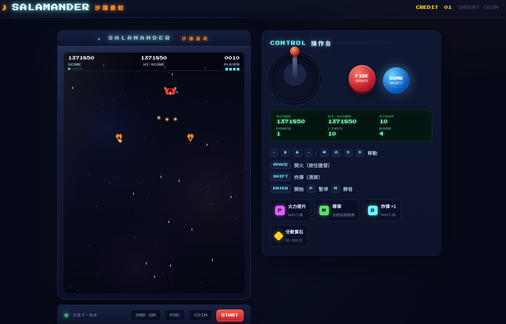

<p align="center">
  
</p>

<p align="center">
  
  
  
  
</p>

<h1 align="center">🐉 SALAMANDER <span style="color:#ff8c1a">沙羅曼蛇</span></h1>

<p align="center">
  <strong>向 1986 年 KONAMI 經典縱版射擊遊戲（STG）致敬的純前端網頁版。</strong><br>
  一個 HTML 檔案即完整遊戲 —— 無外部素材、無套件依賴、無建置步驟。
</p>

<p align="center">
  <a href="#-遊戲特色">遊戲特色</a> ·
  <a href="#-如何執行">如何執行</a> ·
  <a href="#-操作說明">操作說明</a> ·
  <a href="#-遊戲玩法">遊戲玩法</a> ·
  <a href="#-技術實作">技術實作</a>
</p>

---

## ✨ 遊戲特色

| 類別 | 內容 |
| :-- | :-- |
| 🎯 **經典玩法** | 縱版射擊、連發、炸彈清屏、生命 / 關卡系統，完整還原 80 年代 arcade 手感 |
| 👾 **敵人設計** | 5 種行為各異的敵機（偵察／俯衝／側襲／重裝／重砲）＋每關關底巨艦 Boss |
| 🐉 **Boss 戰** | 三種攻擊模式循環（瞄准彈幕／雙側散射／環形），血量過半進入狂暴狀態 |
| 💎 **道具系統** | `P` 火力升級、`M` 自動導彈、`B` 炸彈補充、分數寶石 |
| 🎵 **音訊** | 全部音樂與音效由 **Web Audio API 即時合成**（標題慢拍／戰鬥快拍／Boss 變奏），無任何音檔 |
| 📺 **CRT 外殼** | 掃描線、螢幕眩光、機台 LED、會傾轉的搖桿與會按下的按鈕 |
| 📱 **觸控支援** | 手機 / 平板拖曳即可移動並自動開火 |
| 💾 **進度** | 最高分自動存入 `localStorage`，跨瀏覽器 sessions 保留 |
| 🚀 **效能** | 2× 內部解析度渲染、`requestAnimationFrame` 遊戲迴圈、物件池式過濾，60 FPS 流暢運行 |
| 📦 **零依賴** | 所有圖形皆以 Canvas 路徑繪製，單一檔案、即開即玩 |

---

## 🚀 如何執行

> 本遊戲為**單一 HTML 檔案**，三種方式皆可運行，由簡到繁：

### 方法一：直接開啟（最快）

1. 下載 / 複製 `index.html`
2. **雙擊**該檔案，用瀏覽器開啟即可遊玩

> ⚠️ 部分瀏覽器對 `file://` 開啟的頁面限制 `localStorage`，若最高分不保留，請改用方法二。

### 方法二：本地開發伺服器（推薦）

在專案根目錄執行任一命令，再瀏覽 `http://localhost:8000`：

```bash
# Python 3
python -m http.server 8000

# Node.js
npx serve .
# 或
npx http-server -p 8000
